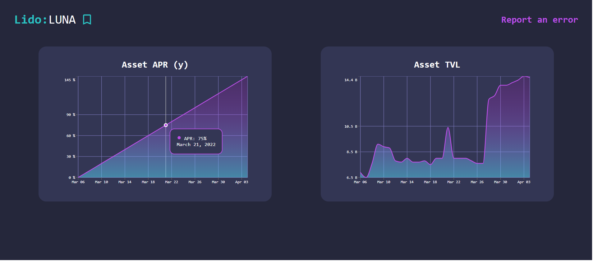

# Getting Started with Multifarm project

This project is build to demonstrate one of cryptos in chart showing data graphs.
Code is build on the top of TypeScript and it's best practices.

Packages used: 
 - recharts,
 - date-fns
 - axios

### Make .env file same as .env-sample

### `npm install`

### `npm start`

